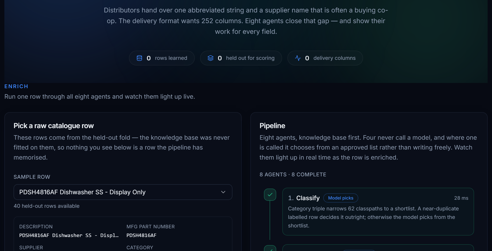
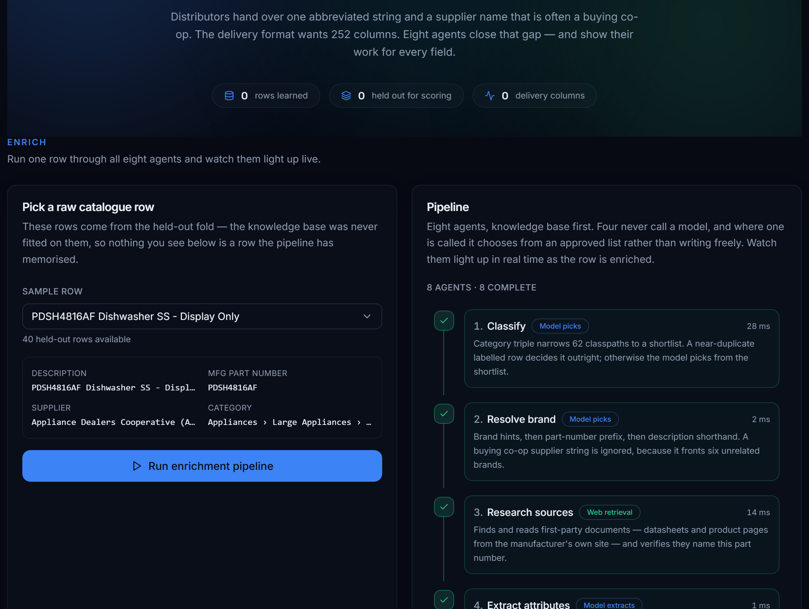
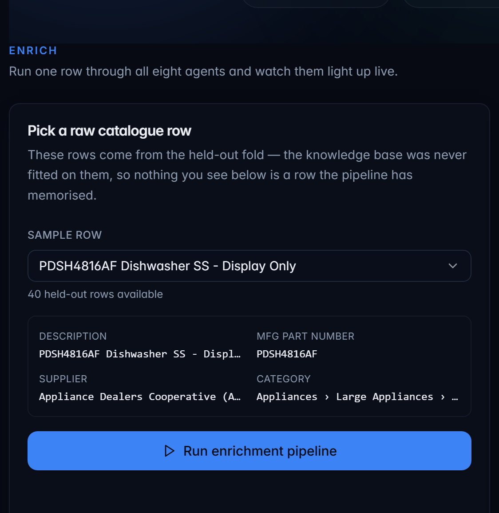
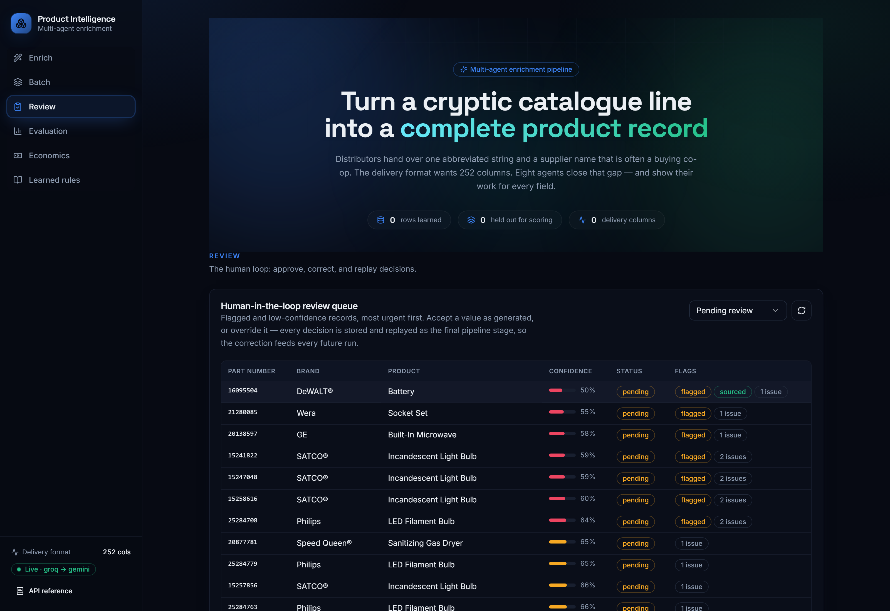
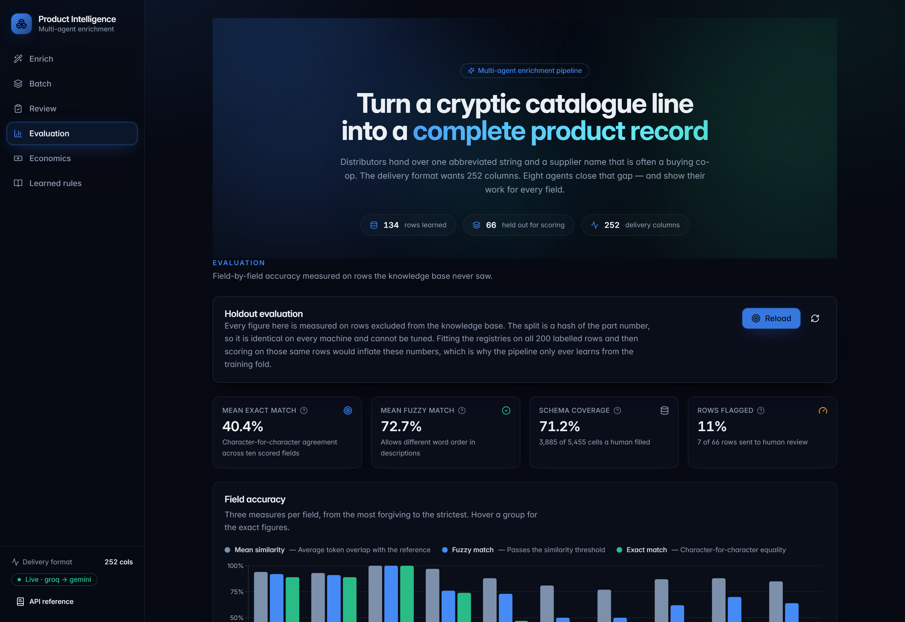
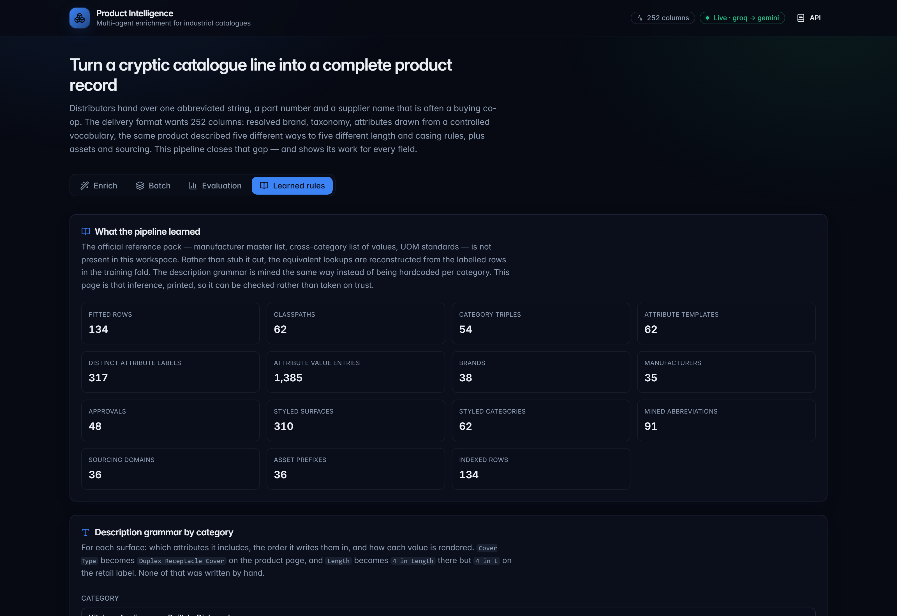

# Product Intelligence — AI Enrichment for Industrial Commerce

**UniHack 2026 · AI-Powered Product Intelligence for Industrial Commerce**

Turn one cryptic distributor line into a complete, standardised, search-ready
product record — and show the working for every field.

```
INPUT   PDSH4816AF Dishwasher SS - Display Only
        Part_Manuf: "Appliance Dealers Cooperative (APPDE)"
        E1_Brand: "-- Unbranded --"   Unilog_Brand: "-- No Unilog Brand --"

OUTPUT  252 columns. Resolved brand and parent manufacturer, taxonomy classpath,
        an ordered attribute grid drawn from a controlled vocabulary, the same
        product rewritten for five surfaces at five different length and casing
        rules, asset filenames, the approved sourcing domain, a per-field
        confidence score and a provenance trail.
```

---

## Results

Measured on a **66-row holdout fold that the knowledge base was never fitted
on**. The split is a SHA-256 hash of the part number, so it is identical on
every machine and cannot be tuned. Reproduce with
`python scripts/run_pipeline.py --fold holdout`.

| Field | Exact | Fuzzy | Similarity |
|---|---:|---:|---:|
| `MANUFACTURER_PART_NUMBER` | **100%** | 100% | 100% |
| `MANUFACTURER_NAME` | **89%** | 92% | 94% |
| `BRAND_NAME` | **89%** | 91% | 93% |
| `Classpath` | **74%** | 76% | 96% |
| `Product Name` | 47% | 73% | 88% |
| `LONG_DESC1` | 0% | 70% | 88% |
| `SHORT_DESC` | 0% | 62% | 87% |
| `RETAIL_DESC` | 0% | 64% | 85% |
| `MOBILE_DESC` | 5% | 50% | 81% |
| `INVOICE_DESC` | 0% | 50% | 77% |
| **Mean** | **40.4%** | **72.7%** | — |

| House rule | Compliance |
|---|---:|
| Invoice ≤ 40 characters | **100%** |
| Invoice ALL CAPS | **100%** |
| Mobile within 60–80 characters | **100%** |
| Unit spacing (`24 in`, never `24in`) | **100%** |
| Fractions not decimals (`50-1/4 in`) | **100%** |

| Also | |
|---|---:|
| Delivery headers matching the Expected Output sheet | **252 / 252**, exact |
| Columns populated | **148 / 252** |
| Schema coverage vs. what a human filled | **71.2%** of the cells a human filled |
| Attribute label precision | **93.2%** (1,397 labels emitted) |
| Attribute value accuracy | 59.8% |
| Rows flagged for human review | 11% (7 of 66) |
| Throughput, scored run | 1.4 s/row wall clock (66 rows in 92 s, 6 concurrent, live web retrieval) |
| Throughput, cached re-run | 0.02 s/row (66 rows in 1.4 s) |
| Model calls | 161 calls, **0 failures** — 11,327 live tokens (92.5% cache-hit); 47,360 worst case cold-cache |
| Models rate-limited mid-run and recovered from | 4 |

### The delivered artefact — all 200 rows

The submitted workbook (`runs/delivery-all-*.xlsx`, produced by
`python scripts/run_pipeline.py --fold all --export`) enriches every input row
in the exact 252-column delivery format. On the full catalogue — in-sample for
134 rows, quoted for the artefact rather than as a skill estimate — the
identity fields score **99% / 95% / 95% / 91.5%** (MPN / manufacturer / brand /
classpath), mean fuzzy match is **84.9%**, coverage **79.4%** of human-filled
cells, and all five house rules hold at **100%**. The holdout table above
remains the honest out-of-sample measurement.

Two further deliverables are generated, not hand-made:
`docs/Evaluation_Report.pdf` (`python scripts/build_report.py`) and the
submission deck with live screenshots embedded
(`python scripts/build_deck.py`).

### Traceability — what retrieval added

The pipeline reads the manufacturer's own website (never a marketplace or
distributor) and every value it takes from one is verifiable:

| | Before retrieval | Now |
|---|---:|---:|
| Verified deep product links in `MFR URL` | 0 / 66 | **14 / 66** |
| `Ref URL 1-2` populated with real first-party documents | 0 / 66 | **6 / 66, 2 / 66** |
| `Country Of Origin` from a first-party source | 0 / 66 | **7 / 66** |
| `HEIGHT` / `WIDTH` / `LENGTH` / `WEIGHT` from source | 0 / 66 | **7 / 66** |
| Attribute values traceable verbatim to a URL | 0 | **88** (26% of filled values) |
| Documents read (product pages + manuals) | 0 | 22 |
| `UPC` / `GTIN` filled | never | only when the check digit validates |

Reach is **21% of rows (14 / 66)** and is reported rather than smoothed over —
see Limitations for why, and why the honest answer is not to raise it by force.

Header compliance is asserted, not asserted-to: `python scripts/verify_schema.py`
compares the exported workbook against the organisers' sheet character by
character and exits non-zero on any drift.

### Reading these numbers honestly

**The description fields score high on similarity and ~0% on exact match, and
that gap is the real story of this dataset.** The reference descriptions contain
specifications — amperage, drum material, annual energy consumption, sound level
in dBA — that appear **nowhere** in the input. A row arrives as fifteen
characters; the reference `LONG_DESC1` is four hundred. Those facts can only come
from the manufacturer's own documentation.

The retrieval stage now reads exactly that documentation — the manufacturer's
own product pages and installation manuals — and feeds the verified
specifications into attribute extraction. Where a first-party page is found,
values are grounded verbatim against the URL they came from. Where it is not,
the pipeline reproduces the *structure, ordering and house style* correctly
(77–88% token similarity) while the *content* stays bounded by what the input
actually contains. It does not paper over the gap by inventing plausible
specifications, because the brief is explicit that a fluent description made of
invented values scores zero. Gaps are surfaced as unfilled attributes and
review flags instead.

The four identity fields are where the input *does* carry enough signal, and
that is where accuracy is high: **100% / 89% / 89% / 74%**.

---

## Screenshots

| | |
|---|---|
| Input vs resolved identity | Five description surfaces |
|  |  |
| Provenance for every decision | Human-in-the-loop review queue |
|  |  |
| Evaluation on the holdout fold | Learned house-style rules |
|  |  |

---

## What makes this different

### 1. The description grammar is learned, not hardcoded

The delivery format writes the same product five times, and each surface has its
own per-category rules. Reading the labelled rows closely shows this is a
*grammar*, not free prose:

```
LONG_DESC1   Southwire® Industrial Surface Cover, Duplex Receptacle,
             Toggle Switch Cover, Square Box, Steel, Galvanized, Silver,
             4 in Length, 4 in Width, Additional Information: 1/2 in Raised
SHORT_DESC   Southwire® G1941-UPC Industrial Surface Cover, Square,
             Duplex Receptacle Cover, Steel, Galvanized, 4 in L, 4 in W
```

Three things vary, and all three are observable:

- **Which** attributes appear. Voltage belongs on the product page, never the
  retail label.
- **What order.** `Box Type` precedes `Cover Type` on the invoice line but
  *follows* it in the attribute template.
- **How each value is written.** The label becomes a *suffix* on the value, and
  which part of the label survives is category specific:
  `Cover Type = Duplex Receptacle` → `Duplex Receptacle Cover`;
  `Length = 4 in` → `4 in Length` on the product page but `4 in L` on the retail
  label; `Voltage Rating = 120 V` drops the label entirely.

Hardcoding that for 62 classpaths is neither feasible nor generalisable. Instead
`backend/knowledge/style.py` **mines** it: for every attribute value it searches
the ground-truth sentence for the value followed by a candidate rendering of its
own label, and votes on what it finds. Candidate-driven matching rather than
free capture is what keeps `Length = 4 in` and `Width = 4 in` apart — both
values are the string `4 in`, but only one is followed by `Width`.

Inspect what was inferred: `python scripts/show_style.py --abbreviations`

The invoice line needed a second pass. Its values are abbreviated (`SST`,
`BLTLN`, `DX RCPT`), so they cannot be located until an abbreviation lexicon
exists. Pass one mines that lexicon by aligning 40-character invoice lines
against the words the same product is described by elsewhere
(`RECEPTACLE → RCPT`, `INDUSTRIAL → INDL`); pass two uses it. The same reading
revealed that invoice lines are written **noun first**:
`Industrial Surface Cover` → `COVER SURF INDL`, `Battery Jump Starter` →
`STARTER JUMP BAT`.

### 2. Brand resolution by catalogue signal, not by supplier string

A buying co-op such as `Appliance Dealers Cooperative (APPDE)` fronts six
unrelated brands, so the supplier field is close to worthless — it resolved
correctly only 50% of the time. Two learned indexes fix most of it:

- **Part-number prefix → brand.** Catalogue numbering is brand specific. Every
  `DR7xxx` is a Speed Queen. This also breaks ties an ambiguous brand string
  cannot: Satco ships its `S`-series as `SATCO®` and its `65`-series as
  `NUVO® by SATCO`, and the brand hint `"Satco"` alone cannot tell them apart.
- **Description shorthand → brand.** `SQ Elect Dryer` names Speed Queen in
  words. Type words are excluded from this index automatically by collecting the
  vocabulary of the Product Name, category and attribute-value fields, so
  `Washer` and `Dryer` never become brand cues.

Both are kept only at ≥85% purity with ≥2 supporting rows, because a wrong brand
propagates into four descriptions and every asset filename. Resolution order
runs unambiguous hint → part-number prefix → ambiguous hint → fuzzy hint →
unambiguous supplier → description shorthand.

Effect: registry-only brand accuracy **72.7% → 84.8%**, and end-to-end
`BRAND_NAME` **76% → 89%**. Audit it per-row with
`python scripts/audit_brands.py`.

### 3. Retrieval replaces model calls where it is more accurate *and* cheaper

The classifier's candidate list contains the correct classpath **100%** of the
time, so classification was never a recall problem — it was a selection problem.
A model asked to choose between twenty-five sibling category paths from a
fifteen-character abbreviation has very little to go on. A TF-IDF character
n-gram index over the labelled descriptions has much more, because near-identical
rows already carry the answer.

Character n-grams, not words: `Elect`, `Electric` and `Elec` share n-grams but
no whole words. The index is built on the **description only** — the candidate
list is already derived from the category triple, so including the triple made
every row in a category look alike and swamped the one field that discriminates.
That mistake cost 11 points of accuracy before it was caught, and the fix is
documented in the module.

Retrieval only overrides the model on a genuine near-duplicate (similarity ≥
0.75) whose nearest rival does not disagree, because a cheap wrong answer is
worse than a paid right one. Effect: `Classpath` 73% → **74%**,
`Product Name` 32% → **47%**, with fewer API calls.

### 4. Generation is structurally constrained

Descriptions are assembled by formula from attributes that have **already passed**
the LOV and UOM checks. A fluent sentence containing an invented specification is
not filtered out after the fact — it is structurally impossible, because the
formula can only reference validated values. Only `MARKETING_DESCRIPTION` is free
prose, and it receives the same validated attribute set with instructions to use
nothing else.

Attribute values are snapped onto the controlled vocabulary; classpaths are
chosen from a shortlist and never generated; brand and manufacturer names are
snapped onto approved spellings so `®` / `™` and legal suffixes match exactly.

### 5. Sourcing and assets are derived, not fabricated

The tail of the schema needs three different levels of caution, and
`backend/pipeline/agents/sourcing.py` applies three:

- **Naming conventions are safe to reproduce.** Asset filenames are constructed,
  not scraped: every labelled row follows `{brand_prefix}_{part_number}.jpg`.
  Applying that rule reproduces a standard. It is still gated on evidence — a
  specification sheet is only named for a brand the training fold shows publishes
  specification sheets. The prefix is *learned* rather than slugified, because
  `Profile™` assets are named `GE_Appliances_*`.
- **Sourcing URLs are constrained.** The guidelines require the manufacturer's
  own site and exclude marketplaces and distributor sites. The registry learns
  brand → approved manufacturer domain and emits that. It does **not** guess a
  deep product path it has never seen: a verified domain is a true statement, a
  fabricated URL is not.
- **Legal text is copied, never guessed.** Warranty, country of origin and the
  Prop 65 notice are reused only where the brand matches.

This is the bulk of the coverage gain: **57% → 71.2%**.

### 6. The evaluation is built to be hard to fool

Every registry is fitted on the training fold only. Fitting on all 200 labelled
rows and then scoring on those same rows produces a meaningless number, and the
temptation to do it is why the split is enforced in `load_split()` rather than
left to the caller. Three families of metric are reported because they answer
different questions:

- **Accuracy** — did we produce what a human editor produced? Exact *and* fuzzy,
  since a description differing by word order is not the same class of error as
  one that is wrong. Identity fields need ≥97 similarity to pass; a near-miss on
  a brand name is simply wrong.
- **Compliance** — does the output obey house rules regardless of ground truth?
  Measurable on a catalogue with no labels at all.
- **Coverage** — how much of the schema did we populate? Completeness without
  accuracy is worthless and accuracy without completeness is a cherry-pick.

### 7. The reviewer teaches the system

Confidence scores and `needs_review` flags route 11% of rows to a human. The
**Review** tab is where that loop closes: a reviewer accepts or overrides any
value, and each decision is appended to a JSONL store keyed by part number. On
every subsequent run the pipeline replays those decisions as its **final stage**,
so a corrected value is never regenerated and never regresses — the system
learns from its reviewer instead of making the same mistake twice. Decisions
store only the fields the reviewer touched, so improvements to the agents still
apply to reviewed rows. The store is a flat append-only file: small, diffable,
needs no database, and survives a restart.

---

## Architecture

```
Excel input ─► records ─┬─► classifier            KB shortlist → retrieval → model picks
                        ├─► manufacturer_resolver hint → MPN prefix → shorthand → model
                        ├─► research              first-party web retrieval + grounding
                        ├─► attribute_extractor   template order + controlled vocabulary
                        ├─► description_builder   learned grammar, five surfaces
                        ├─► sourcing              assets, URL, dimensions  (no model)
                        ├─► validator             limits, casing, UOM, confidence (no model)
                        └─► corrections           reviewer decisions replayed last (no model)
                                   │
                        252-column delivery frame ─► Excel  +  metrics JSON
```

Four of the eight stages never call a model at all. Each stage is wrapped so a
failure degrades one row rather than aborting the batch: a partially enriched row
carrying an explicit issue is more useful than a crash.

```
backend/
  config.py                  pydantic-settings, provider chains, paths
  core/
    schema.py                252-column contract, ProductRecord, Attribute
    normalize.py             placeholders, symbols, decimal→fraction, UOM, casing
  knowledge/
    datasets.py              Excel loading, hash-based train/holdout split
    registry.py              taxonomy, manufacturer, attribute vocabulary, brand signals
    style.py                 mined description grammar + invoice abbreviations
    retrieval.py             TF-IDF nearest-neighbour prior
    assets.py                sourcing domains, asset naming, dimension parsing
    corrections.py           reviewer decisions, replayed as the final stage
  llm/
    providers.py             Groq + Gemini, error classification
    client.py                model-chain fallback, disk cache, usage stats
    pricing.py               token usage → estimated USD + cache savings
  sourcing/
    policy.py                who may be read — fail-closed domain allow-list
    discovery.py             locating a first-party URL for a part number
    fetch.py                 polite, cached, robots-aware retrieval
    extract.py               page → spec pairs, prose, PDF links, JSON-LD
    evidence.py              retrieved material + the citation that travels with it
  pipeline/
    orchestrator.py          eight stages, concurrency, per-stage failure isolation
    agents/                  classifier, manufacturer, research, attributes,
                             descriptions, sourcing, validator
  evaluation/scorer.py       accuracy, compliance, coverage, traceability
  api/                       FastAPI service + job registry + review queue
frontend/                    React + TypeScript + Tailwind + Radix dashboard
scripts/                     run_pipeline, build_kb, serve, audit_brands,
                             inspect_rows, show_style, check_env, list_models,
                             bench_models, diagnose_gaps, verify_schema,
                             build_report (evaluation PDF), build_deck (submission
                             deck with embedded screenshots)
tests/                       182 tests, no network, no API key
```

**A note on the reference pack.** The official
`UniCat_Manufacturer_and_Brand_List`, `Unicat_Lov`, UOM standards and
`Decimal_Fraction` workbooks are not present in this workspace. Rather than stub
them out, the equivalent lookups are **reconstructed from the labelled rows** —
62 classpaths with ordered attribute templates, 317 attribute labels with 1,385
value entries, brand/manufacturer pairs, sourcing domains. Every loader is
isolated in `backend/knowledge/`, so dropping the real workbooks in means
replacing the fit methods, not the pipeline.

---

## Running it

### Prerequisites

Python 3.11+, Node 20+, and an API key for **either** Groq or Gemini (both are
free tiers; the client falls back down a chain of models when one is rate
limited).

### Setup

```bash
python -m venv .venv
.venv\Scripts\activate            # Windows
pip install -r requirements.txt

copy .env.example .env            # then add GROQ_API_KEY or GEMINI_API_KEY
python scripts/check_env.py       # verifies packages, keys, datasets, connectivity
```

### The dashboard

```bash
cd frontend
npm install
npm run build
cd ..
python scripts/serve.py           # http://127.0.0.1:8000
```

Six views: **Enrich** one held-out row and watch the eight agents light up live
(server-sent events) while inspecting every field's provenance and its retrieved
first-party sources; **Batch** a fold or an uploaded catalogue and download the
252-column workbook; **Review** the human-in-the-loop queue — accept or override
any value and the decision is replayed on every future run; **Evaluation** for
the holdout scores and the traceability card; **Economics** for the estimated
cost per record and what the disk cache saves at scale; **Learned rules** to
read the mined grammar and lookup tables.

For frontend development, `npm run dev` on port 5173 proxies `/api` to the
service, so run both.

### Verifying the dashboard

With the service running:

```bash
cd frontend && npm run smoke
```

This loads the real page in your installed Edge or Chrome and fails on any
console error or unhandled rejection. It asserts that React mounts, every lazy
tab panel renders, the browser can reach the API, a batch run completes **twice
in a row** with scores displayed and no error surfaced, and that the chart
tooltip clears 4.5:1 contrast (WCAG AA) on every label it draws.

A build that type-checks is not a build that runs. This check caught five bugs
that `tsc`, Rollup and the API tests were all happy with:

- an empty vendor chunk from hand-tuned `manualChunks` — the bundle built without
  a warning and then had no React to mount with;
- a `React.Children.only` crash, from passing a Radix `Slot` two children;
- a stale poll that made a second batch run fetch its results while still queued;
- a `useEffect` that cancelled its own in-flight request, because it set state
  that was also one of its dependencies;
- dark-on-dark text, twice — an error message using the token meant for a solid
  red fill, and a chart tooltip inheriting its text colour from the bar fill.

The interaction bugs only appear when the UI is driven, and the contrast bugs
only when colours are measured, which is why the check does both rather than
just asserting the page loads.

### The command line

```bash
python scripts/run_pipeline.py --fold holdout --export   # score + write workbook
python scripts/verify_schema.py                          # header + population compliance
python scripts/run_pipeline.py --fold all --limit 20     # spot-check
python scripts/build_kb.py                               # fit + inspect the KB
python scripts/show_style.py --abbreviations             # the learned grammar
python scripts/audit_brands.py                           # brand resolution audit
python scripts/inspect_rows.py --limit 4 --diff          # predicted vs truth
```

`verify_schema.py` is the compliance gate. It confirms all 252 headers match the
Expected Output sheet exactly and none were added, removed or reordered, then
reports which columns are populated — separating columns blank in the reference
too, columns deliberately left blank because they cannot be derived, and genuine
gaps. It found a real one: three input brand columns were being dropped instead
of echoed.

Outputs land in `runs/` as a metrics JSON and, with `--export`, an Excel file in
the exact delivery column order (read from the organisers' workbook, not
hardcoded).

### Cost and scale

The scored holdout run is 66 rows in 92 seconds — 1.4 s/row at 6 concurrent
workers, including live first-party web retrieval — using 161 calls, 149 of
them answered from the disk cache. The live bill was 11,327 tokens (~170 per
row); the worst-case cold-cache bill measured on the same fold is 47,360 tokens
(~720 per row). On the free tiers that is £0; at typical small-model pricing it
is a fraction of a cent per row.

Responses are then cached on disk by prompt hash, so re-running a fold is free
and deterministic and drops to 0.02 s/row (66 rows in 1.4 s). Four of eight
stages never call a model at all, and retrieval removes calls where a labelled
near-duplicate already answers the question.

**On resilience:** during the first web-enabled run four models hit their rate
limits — `gemini-3.6-flash`, `llama-3.3-70b-versatile`, `gpt-oss-20b` and
`qwen3.6-27b`. The client classified each 429 as *exhausted* rather than
*retry*, dropped that model from the chain for the rest of the run and continued
on the next one. Seven models across two providers served the batch and **zero
rows failed**. That behaviour is the difference between a demo and something
that survives a free
tier.

---

## Limitations

Stated plainly, because the brief asks for gaps to be reported rather than
hidden.

- **Retrieval reach is 21% of rows (14 / 66).** A first-party product page was
  located and part-number-verified for 14 holdout rows. The rest have no
  discoverable first-party page (brand has no official domain, the site is
  bot-walled, or the part number is not indexed). Those rows degrade to the
  input-only behaviour rather than borrowing data from a reseller — the sourcing
  rule is enforced, not relaxed to raise the number.
- **Description exact-match is near zero.** The reference descriptions contain
  specifications that exist only in manufacturer documentation; retrieval now
  supplies some of them (grounded values, dimensions, country of origin), but
  the house phrasing itself is still learned structure, not copied content.
- **`EAN` / `UNSPSC` remain empty.** `UPC` and `GTIN` are filled only when a
  first-party source publishes them *and* the check digit validates; the other
  two codes are unguessable and fabricating them would be worse than a blank.
- **Registries are fitted on 134 rows.** 62 classpaths and 38 brands is thin;
  several description surfaces are learned from a single example and fall back to
  a cross-category average. More labelled data improves this directly, with no
  code change.
- **Buying-co-op rows remain the weak spot.** Where the supplier is a co-op, the
  description carries no brand cue and the part-number prefix is unseen, brand
  resolution falls back to the model and is wrong roughly a third of the time.
  These rows are flagged for review rather than passed off as confident.
- **The service has no authentication** and binds to localhost. It is a local
  review tool; an auth layer is required before exposing it on a network.
---

## Deployment (Vercel frontend + Render API)

The pipeline is a long-running FastAPI service (worker threads, in-memory jobs,
streaming), so it cannot run as a Vercel serverless function. The working
split is: **Vercel hosts the static Vite app, Render hosts the API**, and the
frontend reaches the API through the `VITE_API_BASE_URL` build-time variable.

### Backend on Render

1. Push the repo to GitHub.
2. Render dashboard → **New → Blueprint** → connect the repo and select
   `render.yaml` — it already declares every non-secret environment variable,
   the disk mount, and the start command below. (Or **New → Web Service** and
   configure manually; the equivalent settings are listed below.)
3. Configure:
   - Root directory: **leave blank** (repo root — `requirements.txt`,
     `.python-version` and `backend/` all live there; only **Vercel** needs the
     `frontend` root)
   - Runtime: Python (version comes from `.python-version` in the repo root;
     Render ignores `runtime.txt` and defaults to Python 3.14, which lacks
     prebuilt wheels for the pinned pandas/numpy/rapidfuzz versions)
   - Build command: `pip install -r requirements.txt`
   - Start command: `uvicorn backend.api.main:app --host 0.0.0.0 --port $PORT`
   - Keep a **single instance / single worker**: `JobStore` is in-memory by
     design, so multiple workers would not share job state.
4. Environment variables (from `.env` — **all of them**, not just the keys):
   - Secrets (set via Render's "Environment → Secrets", never committed):
     `GROQ_API_KEY`, `GEMINI_API_KEY`
   - Provider & models: `LLM_PROVIDER`, `GROQ_MODEL`, `GROQ_MODEL_FAST`,
     **`GROQ_MODEL_CHAIN`**, **`GEMINI_MODEL`**, **`GEMINI_MODEL_FAST`**,
     **`GEMINI_MODEL_CHAIN`**
   - Pipeline tuning: **`MAX_CONCURRENCY`** (use `2` on the free tier so a
     live run stays inside per-minute limits), **`BATCH_SIZE`**,
     **`LLM_MAX_RETRIES`**, `ENABLE_LLM_CACHE=true`, `CACHE_DIR=.cache`
   - Web retrieval: **`WEB_ENABLED`**, `WEB_CACHE`, `WEB_TIMEOUT`,
     `WEB_MAX_DOCUMENTS`, `WEB_CONTEXT_CHARS`
   - `CORS_ORIGINS=http://localhost:5173,http://127.0.0.1:5173,https://<your-app>.vercel.app`

   Missing any of the `*_MODEL_CHAIN` values silently drops the fallback
   models; missing a whole provider's key silently disables that provider.
   Both degrade accuracy instead of failing loudly, which is why the service
   verifies itself at `/api/health` (see step 6).

5. **Keep the cache.** `.cache/` holds every LLM response and fetched web
   source. Local runs replay it at ~0.02 s/row with the exact answers your best
   model produced; a cold deployed instance must run everything live against
   free-tier quota and falls back to weaker models. So mount a **Persistent
   Disk at the repo's `.cache` directory** (the `render.yaml` blueprint does
   this at `/opt/render/project/src/.cache`), then seed it:

   ```sh
   # Locally (with your best model chain in .env), then let the disk carry it:
   python scripts/seed_cache.py              # the demo holdout rows
   python scripts/seed_cache.py --fold all   # or the full 200-row catalogue
   ```

   Once seeded, deployed re-runs of those rows are instant **and** as accurate
   as local. Note: `.cache/` and `data/corrections.jsonl` live on Render's
   ephemeral disk by default and are lost on redeploy; the disk fixes that for
   `.cache`. For reviewer decisions, mount a second disk over `data/` or commit
   `data/corrections.jsonl` to the repo.

6. Deploy, then verify: `https://<service>.onrender.com/api/health` returns the
   readiness JSON — and now also the **effective** config: `llm.chains` (the
   exact fallback order), `llm.cache.entries` (should be > 0 after seeding),
   `llm.cache.hit_rate` and `llm.cache.failures`. Compare these to your local
   `/api/health`; a mismatch is the reason deployed accuracy drifted.


### Frontend on Vercel

1. Vercel → **Add New → Project** → import the same repo.
2. Configure project (the root directory is the important one):
   - **Root directory:** `frontend` (`package.json`, `vercel.json` and the
     Vite config all live there, not at the repo root)
   - Framework preset: **Vite** (auto-detected) · Build command: `npm run
     build` · Output directory: `dist` — all three are also declared in
     `frontend/vercel.json`, so the deployment does not depend on dashboard
     settings being typed in correctly
   - Node 20+ (declared via `engines` in `frontend/package.json`); the repo's
     `.python-version` file is ignored by Vercel
3. Add the build-time environment variable (Project → Settings →
   Environment Variables, for **Production** and **Preview**):
   `VITE_API_BASE_URL=https://<service>.onrender.com` (no trailing slash).
   With it unset the frontend falls back to same-origin `/api` and behaves
   exactly as it does in local development — which is why it must be set for
   this split deployment.
4. Deploy and verify in the browser DevTools Network tab that `/api/*` calls
   return 200 from the Render origin, and that the Enrich demo streams.

`frontend/vercel.json` also rewrites every unmatched path to `index.html`
(future-proofing client-side navigation) and sets cache headers: immutable
caching for the hashed `/assets/*` filenames, `no-cache` for `index.html`.

### Security

The API has no authentication (see Limitations). After deployment it is
publicly reachable; add an auth layer (or at least a shared API-key header)
before sharing the link broadly.

